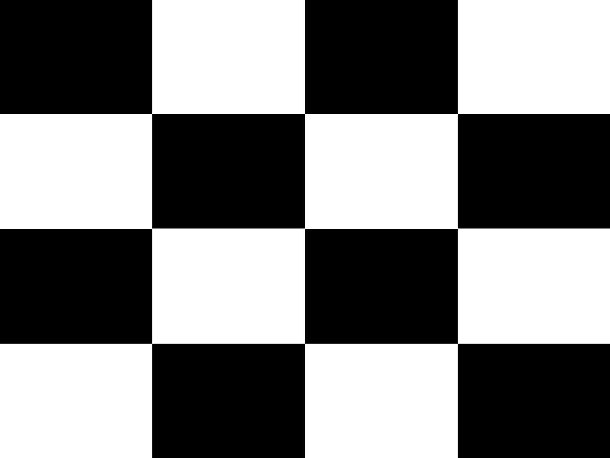

# Description of the data

```
Recording date: Wednesday, January, 18th 2017
Material: projector of the arena and Optitrack (motion capture)
Operator: Dorian Goepp
```

With the beamer, the chessboard `projected-image.jpg` (bellow) is displayed on the arena's floor. A marker is placed at each intersection between two black squares and two white squares.

<!---->
<center></center>

The marker locations are labeled with matrix coordinates, (1.1) is top left, indice is for the row and the second for the column.

## Processed data

> **Caution**: The coordinate system of the motion capture system is skewed! Use this mapping
>
> | motion capture | real world |
> |----------------|------------|
> | X              | Y          |
> | Y              | Z          |
> | Z              | X          |

The processed data is in `summary.csv` (and reproduced bellow).

| row | column | x            | y                     | z             |
|-----|--------|--------------|-----------------------|---------------|
| 1   | 1      | 0.25637538   | 0.0244944             | 1.41601411    |
| 1   | 2      | 0.2509924912 | 0.013912807           | 0.5460249825  |
| 1   | 3      | 0.2483583154 | 0.0095834538          | -0.3233134154 |
| 2   | 1      | 0.9027832794 | 0.0191952059          | 1.4189434412  |
| 2   | 2      | 0.8958511858 | 0.0055972478          | 0.5463919558  |
| 2   | 3      | 0.8943589886 | -8.21136363636364E-05 | -0.3310410909 |
| 3   | 1      | 1.557947625  | 0.01748675            | 1.41974205    |
| 3   | 2      | 1.5534622258 | 0.0032381828          | 0.5424808925  |
| 3   | 3      | 1.5483990455 | -0.0058850909         | -0.336925375  |

## Acquiring the marker's location

Pour obtenir les coordonnées du marqueur, j'ai été obligé de faire des enregistrements avec Motive (logiciel pour la capture de mouvement), comme si on enregistrait un mouvement. J'ai donc obtenu des séries de données dans le temps, exportées en CVS.

In order to retrieve the marker's coordinates, I had to make recordings with Motive (software for motion capture) as if I were recording a motion. I consequently obtained (time-based) data series, exported in CSV. The X, Y and Z values were averaged over the time series.